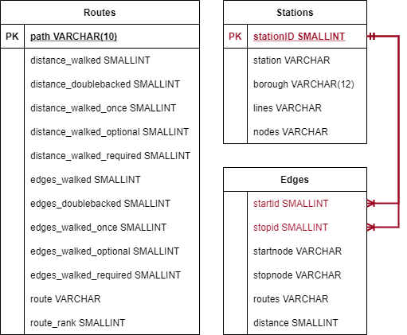

<div align='center'>
    <b> Data Science = Solving Problems = Happiness </b>
</div>
<div align='center'>
    <h1> The Subway Challenge</h1>
</div>
<div align='center'>
    Denzel S. Williams
</div>
<div align='center'>
    <i>Springboard Data Science Track '21</i>
</div>
<div align='center'>
    <a href="https://linkedin.com/in/williamdst">
        
    </a>
    <a href="https://nbviewer.jupyter.org/github/Williamdst/The-Subway-Challenge/blob/main/Subway-Report.ipynb">
        
    </a> 
    <a href="https://github.com/Williamdst/The-Subway-Challenge/blob/main/Subway-Presentation.pdf" />
        
    </a>
</div> 

<h2> 0. Inspiration </h2>
I'm sort of an efficiency junkie and I have always enjoyed logistics, optimization, and basically anything that involves how people/things move. I honestly have no clue how I came across the <a href="https://en.wikipedia.org/wiki/Subway_Challenge">Subway Challenge</a>, but I it is as a massive logistics problem and I COULDN'T RESIST tackling it. <b>Also I want to win a world record.</b>

<h2> I. Introduction </h2>
To set a record in the Subway Challenge a participant must navigate the entire New York City Subway system (network) in the shortest time possible. The challenge requires competitors to stop at all 472 stations in the network and no person currently holds that record <a href="https://en.wikipedia.org/wiki/Subway_Challenge#Guinness_Record_times"> [1] </a>. The most recent record of 21H:28M:14S was set on July 22, 2016 by Matthew Ahn for the 469-Station Challenge <a href="https://www.timeout.com/newyork/blog/solo-straphanger-sets-new-all-station-subway-world-record-090616"> [2]</a>. Aside from beginning at Far Rockaway-Mott Avenue and ending at Flushing-Main Street, the route and methodology he used to beat the record is unknown. <br></br>

<p style='text-align:center', align='center'> <b>The goal of this project is to use graph theory to determine a set of paths that could potentially be used to beat the current record.</b> </p>

<h2> II. Understanding the Problem </h2>
To solve this problem a graph representation of the subway system needs to be constructed. The system can be modeled as a weighted undirected graph, where the weights on the edges are the time it takes to get from one station to the next. Since you can travel in both directions on each line the direction is not needed (<i>there is one station that is an exception</i>). The actual map of the system needs to be translated into nodes and edges; to simplify this translation the <a href="https://new.mta.info/map/5336">Late-Night Subway Service</a> map is used. In the late-night subway map all stations are served though not all lines run; most lines run local, making all stops. The late-night map is a starting point to attempt beating the challenge. The map cannot be used, as is, to beat the challenge because the map is only valid from 00:00 - 06:00 every day. The results of the late-night map will tell you <b>what</b> to do, but not <b>how</b> to do it. <br></br>

Once 06:00 hits, all trains are activated, and express routes are implemented. For example, the late-night A-Train might go to certain stops, but it skips over them in the day. In the day, the A-Train is an express train and staying on it for the entire line wouldn’t take you to every stop. At some point you would have to get off and make a transfer to the local C-train to check off the stops that the A-Train skips. This is the main reason why the objective is to determine a set of paths and not just a single path. The only weight the program understands is the time between stations, it doesn't understand that train switching is expensive. Every time you get off a train you must wait for the next one to arrive, which adds to the overall time. Therefore, the program can only return a set of potential options that a human would then need to filter through.

<h2> III. Modeling the MTA Subway System </h2>  
The bulk of the work is translating the map into nodes and edges, saving them as CSV files that the program can understand. Like any route-inspection style problem, the Subway Challenge is about decision making, specifically what are you going to do at junctions, <i>stations where you can transfer to a different line</i>, or in the graph theoretical sense, nodes with degree greater than 2. Of the 472 stations in the system there are only 79 junctions which I call "decision stations".

<h2> IV. Modifying a Prepackaged Solution </h2>
In 2017, <a href="https://github.com/brooksandrew">Andrew Brooks</a> was tackling a similar problem which he solved using the NetworkX 2.0 library <a href="https://www.datacamp.com/community/tutorials/networkx-python-graph-tutorial"> [3]</a>. Thankfully, he packaged his solution into the <a href="https://github.com/brooksandrew/postman_problems">postman_problems</a>. With this package, you can plug in your own network and solve the <a href="https://www-m9.ma.tum.de/graph-algorithms/directed-chinese-postman/index_en.html#:~:text=The%20(Chinese)%20Postman%20Problem%2C,then%20return%20to%20the%20origin.">Chinese Postman Problem</a> (CPP). Unfortunately, the Subway Challenge isn't a typical CPP problem. The postman always wants to return to his vehicle, so the CPP finds a path that ends where it began. The Subway Challenge has no such requirement, the sole condition is to travel to all the edges at least once. Andrew's postman_package solves the CPP as is, therefore plugging in the subway network wouldn't work because it would always output a sub-optimal solution. However, with a little bit of network theory, the NetworkX 2.5 update, and some tweaks to his package, I was able to build on his work to solve the problem.<br />

<h4> Installing My Cloned Package </h4>

```shell
pip install git+https://github.com/Williamdst/postman_problems.git
```

<h2> V. The Routes </h2>
Of the 79 stations, there were 58 odd-degree nodes resulting in 1653 start-end configurations. To store all of the configurations and their stats, a simple SQLite database was integrated in the program. <br> </br>

<p align='center'>
    
    <p align='center'> Figure 1. Entity Relationship Diagram of the Database </p>
</p>

If you never had to double back and could teleport to whatever station you needed to, the time it would take to traverse each of the 104 edges <b>EXACTLY</b> one time would be 14.75 hours (884m). The rest of the time is spent going back over edges you already traveled; in Matthew Ahn's case that was nearly 7 hours. The columns that are used to pick a route are distance_walked and distance_doublebacked. The reason that edges_walked isn't a major concern is because it matters <b>what</b> edge you had to double back over. You can't make the claim that a route with 150 edges_walked is better than a 151-edge route, because that one edge may be the worst edge in the network.

The node that was in 8 of the 10 top routes, <i>either as the start or the end station</i>, was 416 Wakefield-241 St (The last stop of the 2 train). What's more interesting is that all the nodes paired with it were also extreme stations, meaning, they were at the end of a line. More than that, those extremes were aggressively extreme, not only were they at the end of a line, but they were also at the end of lines that had no transfer opportunities and took over 15m to reach. The route that Matthew took started and ended at two very aggressive extremes and the path that contained those two extremes took 21.06 hours (37th ranked route).

<h4> The "Best" Routes </h4>
Picking out the best route isn't as straight-forward as querying the database, finding the path with minimal distance, and following the directions. Remember, the program doesn't understand the cost of excessive transfers, that there are transfers that provide shortcuts, and the network topology isn't static. The one major insight that can be used to filter out routes is that aggressively extreme stations are where you want to start and where you want to end, which leaves about only 10 choices (45 configurations). The steps for the best routes aren’t listed in this report because each route has over 145 steps, but there is a <code>Describe-Route.sql</code> file in the repository that contains the query to use to list out all the steps for any path. The properties of the most interesting paths are shown in the table below: <br> </br>

<table>
    <tr>
        <th></th>
        <th> Start Station </th>
        <th> Stop Station </th>
        <th> Time (Hrs) </th>
        <th> Route Rank </th>
    </tr>
    <tr>
        <th> Gold Route </th>
        <td>Wakefield-241 St <i>(2-Train)</i></td>
        <td>Woodlawn <i>(4-Train)</i></td>
        <td>20.65</td>
        <td>1</td>
    </tr>
    <tr>
        <th> Silver Route </th>
        <td>Wakefield-241 St <i>(2-Train)</i></td>
        <td>Norwood-205 St <i>(D-Train)</i></td>
        <td>20.66</td>
        <td>2</td>
    </tr>
    <tr>
        <th> Bronze Route </th>
        <td>Wakefield-241 St <i>(2-Train)</i></td>
        <td>Pelham Bay Park <i>(6-Train)</i></td>
        <td>20.7</td>
        <td>3</td>
    </tr>
     <tr>
        <th> The Worst Route </th>
        <td>Sutphin Blvd-Archer Av-JFK Aiport <i>(E-Train)</i></td>
        <td>Coney Island-Stillwell Av <i>(D-Train)</i></td>
        <td>22.35</td>
        <td>1653</td>
    </tr>
    <tr>
        <th> Matthew Ahn's Route </th>
        <td>Far Rockaway-Mott Av <i>(A-Train)</i></td>
        <td>Flushing-Main St <i>(7-Train)</i></td>
        <td>21.06</td>
        <td>37</td>
    </tr>
    <tr>
        <th> The Route I May Implement</th>
        <td>Wakefield-241 St <i>(2-Train)</i></td>
        <td>Far Rockaway-Mott Av <i>(A-Train)</i></td>
        <td>20.75</td>
        <td>4</td>
    </tr>
</table>

<hr>

<h3> Acknowledgements </h3>

I want to give a shoutout to my mentor Devin Cavagnaro for teaching me about agile project management. Without the iterative approach of agile management the project would have been thrown in the trash. <br></br>

Big thanks to Andrew Brooks for his work and the well put together postman_problems package, I couldn't have completed the project without it. And once again, <a href="https://github.com/alexandresanlim/Badges4-README.md-Profile"> Alexandre Sanlim </a> for the repository of awesome badges
